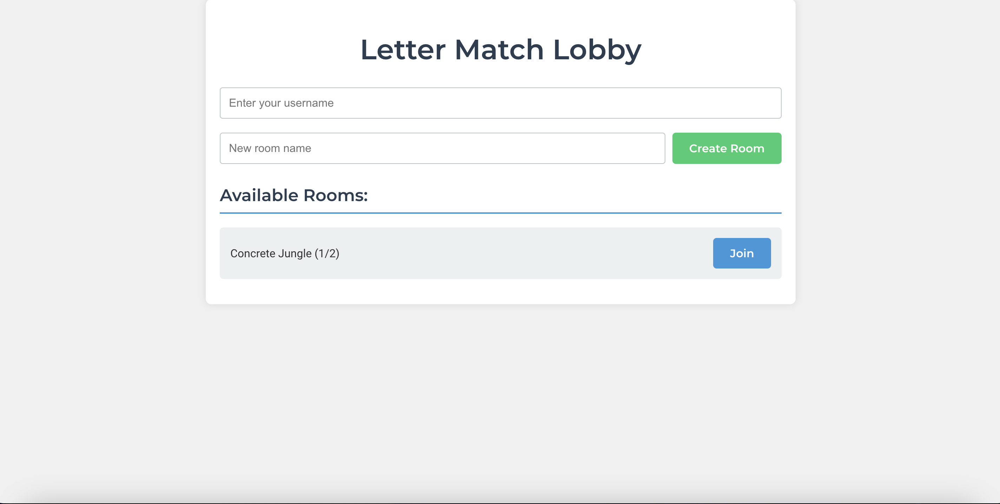
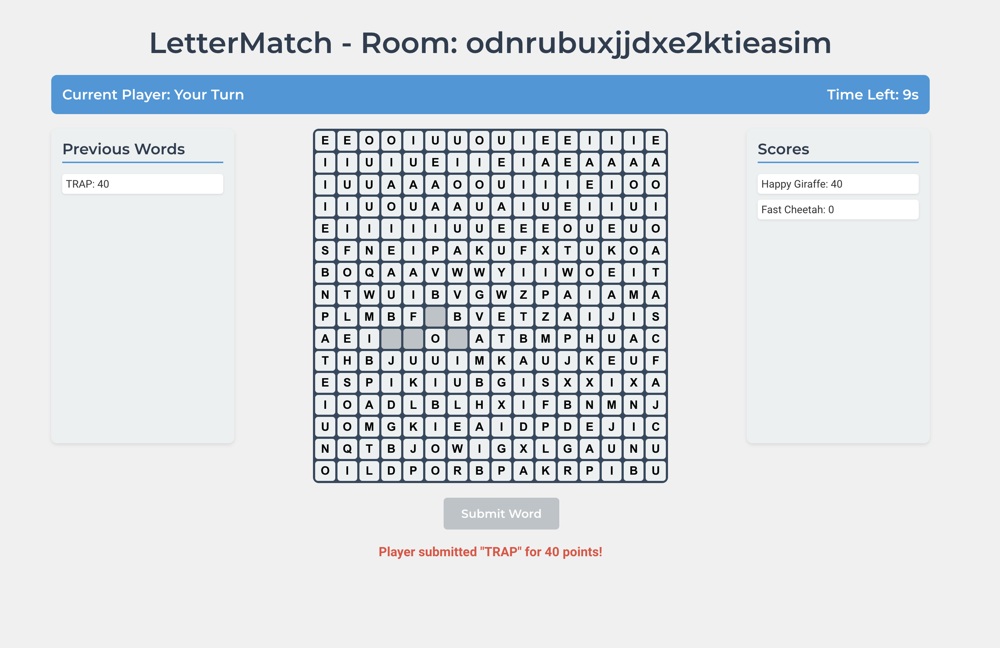

# Letter Match

Letter Match is a real-time multiplayer word game where players compete to form words from a shared grid of letters.

## Screenshots

### Lobby


### Game in Progress


## Table of Contents

1. [Features](#features)
2. [Technologies Used](#technologies-used)
3. [Installation](#installation)
4. [How to Play](#how-to-play)
5. [Project Structure](#project-structure)
6. [Game Rules](#game-rules)
7. [Contributing](#contributing)
8. [License](#license)

## Features

- Real-time multiplayer gameplay
- Dynamic letter grid
- Score tracking
- Timed rounds
- Lobby system for creating and joining game rooms

## Technologies Used

- Frontend:
  - React.js
  - Socket.io-client for real-time communication
- Backend:
  - Node.js
  - Express.js
  - Socket.io for WebSocket connections
- Additional libraries:
  - an-array-of-english-words for word validation

## Installation

1. Clone the repository:
   ```
   git clone https://github.com/yourusername/letter-match.git
   cd letter-match
   ```

2. Install dependencies for both frontend and backend:
   ```
   cd letter-match-backend
   npm install
   cd ../letter-match
   npm install
   ```

3. Start the backend server:
   ```
   cd letter-match-backend
   npm start
   ```

4. In a new terminal, start the frontend development server:
   ```
   cd letter-match
   npm start
   ```

5. Open your browser and navigate to `http://localhost:3000` to play the game.

## How to Play

1. Enter the lobby and create a new room or join an existing one.
2. Wait for another player to join your room.
3. Once the game starts, you'll see a grid of letters.
4. Click on adjacent letters to form words.
5. Submit words to score points. Longer words score more points.
6. The game alternates turns between players.
7. When time runs out for a player's turn, it switches to the other player.
8. The game ends when all letters have been used or no more words can be formed.

## Project Structure

- `letter-match/`: Frontend React application
  - `src/`
    - `LetterMatch.js`: Main game component
    - `Lobby.js`: Lobby component for room management
    - `socket.js`: Socket.io client configuration
- `letter-match-backend/`: Backend Node.js server
  - `server.js`: Express and Socket.io server setup

## Game Rules

- Minimum word length: 3 letters
- Words must be valid English words
- Letters must be adjacent (horizontally, vertically, or diagonally)
- Each letter can only be used once per word
- Score is calculated based on word length (10 points per letter)
- Players have 30 seconds per turn

## Contributing

Contributions are welcome! Please feel free to submit a Pull Request.
